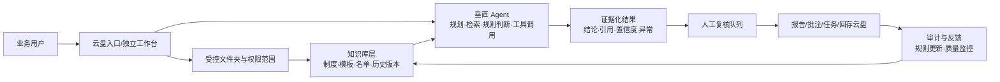

# 基于知识库的垂直场景类 Agent：云盘合作机会探索

> 版本：探索稿 v0.1｜日期：2026-08-14
>
> 目的：探索“云盘 + 领域知识库 + Agent”是否形成独立产品机会，明确优先场景、用户需求、合作形态和下一步验证方式。本文不是立项方案，也不等同于技术设计。

## 0. 先给结论

最值得优先验证的不是“一个能回答所有问题的企业知识库”，而是**围绕高频、强规则、需要留痕的文件工作流 Agent**。云盘的核心价值不是提供一个文件入口，而是提供 Agent 可以持续工作的“可信上下文”：文件、版本、权限、组织关系、历史记录和结果回存。

建议首期聚焦一个可闭环场景：

> **财务票据 / 合同合规核验 Agent**：从指定文件夹取数 → 按企业规则核验 → 给出逐条结论与引用 → 发起人工复核 → 生成报告并回存云盘。

它比通用问答更容易证明价值：输入和输出都在云盘内，判断规则相对稳定，错误可人工复核，结果能够审计，且能直接承接当前原型中的“票据核验、合同审阅、多文件问答、版本对比”等能力。

## 1. 探索边界与已有基线

### 已有基线

当前项目已经具备 8 个独立 AI 工具原型，覆盖：文件问答、合同审阅、票据核验、课程件整理、报告、翻译、音频转文字、文件收集等，并已有桌面/移动端流程、人工复核和失败状态设计。

### 本次探索新增的问题

1. 什么时候“工具”需要升级为“Agent”？
2. 哪些垂直场景会持续依赖知识库，而不是一次性上传文件？
3. 云盘应当是入口、知识底座、执行空间，还是结果归档？
4. 独立产品与云盘内置能力，哪种形态更适合验证？
5. 需求探索阶段如何避免被“模型能力展示”带偏？

### 不在本轮解决

- 具体模型选型、向量数据库、Agent 编排框架。
- 全行业知识库覆盖。
- 无人值守自动审批。
- 对外销售定价和完整商业预测。

## 2. 用户问题：从“找文件”到“完成工作”

| 角色 | 当前任务 | 真实痛点 | Agent 可能承担的工作 | 成功信号 |
|---|---|---|---|---|
| 财务/出纳 | 报销、发票、付款资料核验 | 规则散落、人工逐张比对、缺证据 | 抽取字段、匹配制度、识别异常、列出缺口 | 单据处理时长下降；复核有据可查 |
| 法务/合同管理员 | 合同审阅、版本比对、到期跟踪 | 条款多、版本混乱、风险遗漏 | 按模板审阅、定位条款、比较版本、生成待办 | 首轮审阅更快；引用准确；风险可分级 |
| 销售/交付 | 找方案、投标材料、客户答疑 | 内容分散、旧版本误用、重复问专家 | 根据客户/项目组装答案与材料包 | 找资料时间下降；输出可复用 |
| HR/培训 | 制度答疑、入职、课程运营 | 制度更新后员工仍问旧答案 | 基于生效版本回答，解释适用范围 | 答案一致；能追溯制度版本 |
| 运营/门店 | SOP 执行、异常处理 | 一线不熟规则，信息在群里 | 通过场景问答给出步骤和所需材料 | 一线解决率上升；升级更准确 |
| 管理者 | 经营/项目复盘 | 看报告耗时，数据和原文分离 | 汇总文件夹状态，生成有引用的摘要 | 决策准备时间下降 |

## 3. 什么才算“垂直 Agent”

垂直 Agent 不是把提示词写长，而是同时具备 5 个特征：

1. **领域目标明确**：完成核验、审阅、归档、答疑等工作结果，而不是泛泛聊天。
2. **知识边界可声明**：只使用指定知识源、有效版本和授权范围。
3. **工具调用可观察**：搜索文件、读取版本、调用规则、生成报告、回存结果，每一步有状态。
4. **结果可复核**：结论必须带原文引用、置信度、规则依据和待确认项。
5. **能推动下一步**：创建任务、通知负责人、请求补充材料或提交人工审批。

可用一个判断式筛选场景：

> 场景分 = 频次 × 文件依赖度 × 规则稳定度 × 错误可控度 × 闭环价值 ÷ 接入复杂度

## 4. 场景机会地图

### A 级：最适合首期验证

**A1 财务票据与报销核验**

- 知识：报销制度、发票规则、供应商/项目名单、历史模板。
- Agent 动作：批量读取文件夹 → 抽取票据字段 → 规则校验 → 识别重复/缺失/异常 → 生成复核队列。
- 云盘合作点：按部门/项目权限取数；保留原件；异常报告回存原文件夹。
- 主要风险：税务判断边界、OCR 质量、跨系统数据缺失。

**A2 合同审阅与版本风险 Agent**

- 知识：合同模板、条款库、授权矩阵、历史谈判版本。
- Agent 动作：识别合同类型 → 按条款清单审阅 → 对比版本 → 标注风险 → 生成谈判问题清单。
- 云盘合作点：版本链、共享权限、审阅结果与原文关联。
- 主要风险：不可把建议表述成法律结论；需强制引用与人工确认。

### B 级：高潜力但需更强业务接入

- 投标/售前材料组装 Agent：基于客户行业、产品版本和案例库生成材料包。
- 项目交付/验收 Agent：从交付文件中检查缺件、里程碑和验收标准。
- HR 制度与入职 Agent：根据员工身份、地区和生效日期回答制度并生成清单。
- 教学/培训备课 Agent：从课程件、题库和学情文件生成教案、练习和复盘。

### C 级：适合作为通用底座能力

- 文件夹摘要、跨文件问答、会议纪要回存、翻译、归档建议。
- 这些能力重要，但单独作为产品的差异化和付费理由偏弱。

## 5. 三种产品形态与建议

| 形态 | 用户体验 | 云盘合作深度 | 优点 | 短板 | 建议 |
|---|---|---|---|---|---|
| 云盘内置 Agent | 在文件夹/文件详情页直接使用 | 深 | 上手快，权限和回存天然闭环 | 受云盘产品边界限制 | 作为主路线 |
| 独立垂直工作台 | 独立 Web/桌面产品，连接云盘 | 中-深 | 能做更完整的队列、规则和审批 | 需登录、授权、建立心智 | 作为专业版/试点形态 |
| Agent API/插件 | 嵌入 ERP、OA、财务或法务系统 | 深但复杂 | 可进入核心流程，客单价高 | 集成成本和销售周期长 | 二期验证 |

**推荐组合：云盘内置入口 + 独立垂直工作台。**

云盘内置入口负责“发现、选范围、看结果、回存”；独立工作台负责“批量任务、规则配置、复核队列、审计报表”。两者共享知识源和任务状态，避免把云盘做成复杂后台。

## 6. 首个 Agent 的需求假设

### 核心 Job-to-be-Done

> 当我把一批票据或合同放进指定云盘文件夹后，我希望系统能按照本公司的规则完成初审，并告诉我哪些通过、哪些异常、为什么异常、依据在哪里，以及下一步由谁处理。

### 最小闭环

1. 选择一个“受控文件夹”作为任务输入。
2. 绑定知识源：制度/规则、模板、名单；标注生效时间和负责人。
3. 运行批量分析，显示处理中、待复核、失败、已完成、已回存。
4. 每条结论展示：结论、证据引用、规则依据、置信度、缺失信息。
5. 人工确认、驳回或补充材料；系统记录操作人和时间。
6. 生成报告、复核清单或批注，并回存云盘；原文件不被覆盖。

### 必须有的非功能需求

- 权限继承：Agent 不得看到调用者无权访问的文件。
- 时间有效性：回答和规则匹配必须显示使用的版本/生效日。
- 引用完整：关键结论必须能一键定位原文。
- 可解释失败：权限不足、解析失败、来源冲突、超大文件要分别提示。
- 可撤销：回存、批注、任务通知等动作可撤销或保留历史版本。
- 数据边界：明确哪些内容不出域、不用于训练、保存多久。

## 7. 需求探索要验证的 10 个假设

| 假设 | 关键问题 | 低成本验证 | 通过指标（建议） |
|---|---|---|---|
| H1 | 用户愿意把受控文件夹交给 Agent 批量处理 | 访谈 + 真实脱敏样本演示 | 8/10 目标用户愿意试用 |
| H2 | 引用比“答案更聪明”更能建立信任 | A/B 原型测试 | 带引用版本复核采纳率更高 |
| H3 | 异常队列比聊天窗口更接近工作流 | 任务流与聊天流对比 | 完成一个批次的时间更短 |
| H4 | 规则负责人愿意维护知识源 | 观察建库过程 | 30 分钟内完成首个规则集 |
| H5 | 云盘权限是购买理由而非技术细节 | 销售/管理员访谈 | 至少 3 个客户主动提及权限/审计 |
| H6 | 首个场景的错误边界可接受 | 双人复核 + 误报漏报记录 | 高风险结论零无引用输出 |
| H7 | 结果回存能形成闭环 | 试点任务追踪 | 过半任务完成回存/归档 |
| H8 | 专业工作台值得独立存在 | 观察高频批处理 | 每周至少 2 次批量任务 |
| H9 | 用户愿意为节省的复核时间付费 | 价值访谈/概念报价 | 明确预算来源和采购人 |
| H10 | 场景可从单部门复制到相邻部门 | 多部门试点 | 规则复用率和扩展意愿达标 |

## 8. 研究与验证计划（4 周）

### 第 1 周：问题与证据

- 访谈 6–8 人：财务、法务、知识负责人、IT 管理员、业务负责人。
- 收集 3 类脱敏文件包：票据、合同、制度。
- 记录当前流程：入口、人工判断、协作、留痕、归档。

### 第 2 周：概念原型

- 做 3 个可点击概念：批量核验队列、合同审阅工作台、制度问答入口。
- 重点测试“引用、置信度、异常原因、回存、权限提示”，不测试模型炫技。

### 第 3 周：人工模拟试点

- 用人工/半自动方式跑 20–50 个真实任务。
- 比较现状与 Agent 辅助后的时长、错误、复核轮次和信任度。

### 第 4 周：商业与产品决策

- 评估首个垂直场景是否进入 MVP。
- 决定内置入口、独立工作台、API 的优先级。
- 形成“继续/调整/停止”决策和 90 天路线图。

## 9. 产品架构草图

## 10. 与云盘的合作接口清单

### 云盘提供

- 文件/文件夹读取、版本读取、元数据和权限校验。
- 受控范围选择、变更监听、结果回存、版本不覆盖。
- 评论/批注、任务通知、分享和审计日志。

### Agent 产品提供

- 知识源注册、分层和生效管理。
- 领域规则、任务模板、批量处理和复核队列。
- 引用、置信度、异常分类、人工反馈和质量报表。

### 双方必须共同定义

- 权限穿透与越权失败行为。
- 文件删除、移动、版本冲突时任务如何处理。
- 生成内容的归属、留存和训练使用边界。
- 结果回存的命名、目录和版本策略。

## 11. 关键风险与反例

- **“有知识库就有价值”是错觉**：若任务不需要引用、判断和下一步动作，通用搜索/问答可能已足够。
- **知识维护成本会反噬价值**：必须提供负责人、有效期、冲突提示和“未找到依据”状态。
- **权限是体验的一部分**：回答“看不到”时要解释原因和申请路径，不能只返回空结果。
- **高风险行业不能自动拍板**：财务、法务、医疗等场景应把 Agent 定位为初审与协作，不输出无条件确定性结论。
- **独立产品可能制造孤岛**：若结果不能回到云盘和原业务流程，用户会把它当临时工具。

## 12. 推荐的下一步决策

1. 选定“财务票据核验”或“合同审阅”中的一个作为首个试点，不同时启动两个完整产品。
2. 找到 1 个愿意提供脱敏样本和真实复核人的试点组织。
3. 先验证 5 个体验关键点：受控文件夹、证据引用、异常队列、人工确认、结果回存。
4. 以“每批任务节省多少复核时间、多少结论被采纳、多少结果成功回存”作为首期指标。
5. 只有在闭环成立后，再扩展为垂直 Agent 平台和 API。

## 附：当前原型到 Agent 化的映射

| 当前原型能力 | Agent 化升级方向 |
|---|---|
| 文件问答 | 从单次问答升级为受控知识源问答，带版本和引用 |
| 合同审阅 | 从上传即审阅升级为合同类型识别、规则集、复核队列和版本链 |
| 票据核验 | 从单文件检查升级为批量任务、异常分级、报告回存 |
| 课程件整理 | 从一次整理升级为课程知识库、模板复用和备课任务 |
| 报告 | 从生成文档升级为有证据的周期性汇总和订阅 |
| 文件收集 | 从收集链接升级为按任务缺件追踪和自动提醒 |

## 结论

云盘与垂直 Agent 的最佳合作点，是把“文件存储”变成“可授权、可引用、可执行、可留痕的工作上下文”。第一阶段应证明一个高价值闭环，而不是证明一个万能 Agent。若票据/合同试点能够稳定完成“读取—判断—复核—回存”，再把规则、知识源、任务状态和审计能力抽象成平台底座，才有机会形成独立产品形态。
